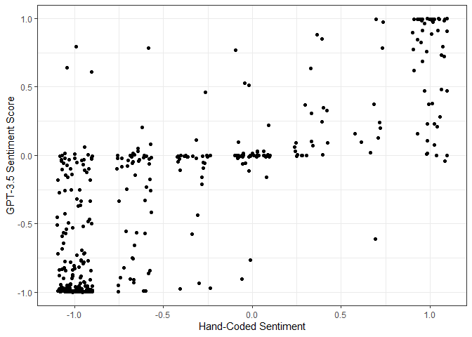

<!-- README.md is generated from README.Rmd. Please edit that file -->

# promptr 

<!-- badges: start -->
<!-- badges: end -->

We developed the `promptr` package so that researchers could easily
format and submit LLM prompts using the R programming language. It
provides a handful of convenient functions to query the OpenAI API and
return the output as a tidy R dataframe. The package is intended to be
particularly useful for social scientists using LLMs for text
classification and scaling tasks.

## Installation

You can install the development version of `promptr` from
[GitHub](https://github.com/) with:

``` r
# install.packages("devtools")
devtools::install_github("joeornstein/promptr")
```

You will also need an account with OpenAI. You can sign up
[here](https://beta.openai.com/signup), after which you’ll need to
generate an API key
[here](https://platform.openai.com/account/api-keys). We recommend
adding this API key as a variable in your operating system environment
called `OPENAI_API_KEY`; that way you won’t risk leaking it by
hard-coding it into your R scripts. The `promptr` package will
automatically look for your API key under that variable name, and will
ask you to enter the API key manually if it can’t find one there. If
you’re unfamiliar with setting Environment Variables in your operating
system,
[here](https://dev.to/biplov/handling-passwords-and-secret-keys-using-environment-variables-2ei0)
are some helpful instructions. Note that you may need to restart your
computer after completing this step.

## Completing Prompts

The workhorse function of the `promptr` package is `complete_prompt()`.
This function submits a prompt to the OpenAI API and returns a dataframe
with the five most likely next word predictions and their associated
probabilities.

``` r
library(promptr)

complete_prompt('I feel like a')
#>    token probability
#> 1    lot  0.20988509
#> 2 little  0.02118226
#> 3    kid  0.01375050
#> 4    new  0.01209023
#> 5    big  0.01204562
```

If you prefer the model to autoregressively generate text instead of
outputting the next-word probabilities, you can set the `max_tokens`
input greater than 1. The function will return a character object with
the most likely completion.

``` r
complete_prompt('I feel like a', max_tokens = 18)
#> [1] " lot of people are gonna be like, \"Oh, I'm gonna be a doctor.\"\n\n"
```

Note that by default, the `temperature` input is set to 0, which means
the model will always return the most likely completion for your prompt.
Increasing temperature allows the model to randomly select words from
its estimated probability distribution (see the [API
reference](https://platform.openai.com/docs/api-reference/completions)
for more on these parameters).

You can also change which model variant the function calls using the
`model` input. By default, it is set to “gpt-3.5-turbo-instruct”, the
RLHF variant of GPT-3.5. For the base GPT-3 variants, try “davinci-002”
(175 billion parameters) or “babbage-002” (1.3 billion parameters).

## Formatting Prompts

Manually typing prompts with multiple few-shot examples can be tedious
and error-prone, particularly if you want to include context-specific
instructions or few-shot examples. We include the `format_prompt()`
function to aid in that process.

The function is designed with classification problems in mind. If you
input the text you would like to classify along with a set of
instructions, the default prompt template looks like this:

``` r
prompt <- format_prompt(text = 'I feel positively morose today.', 
                        instructions = 'Decide whether this statment is happy or sad.')
prompt
#> Decide whether this statment is happy or sad.
#> 
#> Text: I feel positively morose today.
#> Classification:
```

You can customize the template using `glue` syntax, with placeholders
for {text} and {label}.

``` r
format_prompt(text = 'I feel positively morose today.',
              instructions = 'Decide whether this statment is happy or sad.',
              template = 'Statement: {text}\nSentiment: {label}')
#> Decide whether this statment is happy or sad.
#> 
#> Statement: I feel positively morose today.
#> Sentiment:
```

This function is particularly useful when including few-shot examples in
the prompt. If you input these examples as a tidy dataframe, the
`format_prompt()` function will paste them into the prompt according to
the template. The `examples` dataframe must have at least two columns,
one called “text” and the other called “label”.

``` r
examples <- data.frame(
  text = c('What a pleasant day!', 
           'Oh bother.',
           'Merry Christmas!',
           ':-('),
  label = c('happy', 'sad', 'happy', 'sad')
)

examples
#>                   text label
#> 1 What a pleasant day! happy
#> 2           Oh bother.   sad
#> 3     Merry Christmas! happy
#> 4                  :-(   sad

prompt <- format_prompt(text = 'I feel positively morose today.',
                        instructions = 'Decide whether this statment is happy or sad.',
                        examples = examples,
                        template = 'Statement: {text}\nSentiment: {label}')

prompt
#> Decide whether this statment is happy or sad.
#> 
#> Statement: What a pleasant day!
#> Sentiment: happy
#> 
#> Statement: Oh bother.
#> Sentiment: sad
#> 
#> Statement: Merry Christmas!
#> Sentiment: happy
#> 
#> Statement: :-(
#> Sentiment: sad
#> 
#> Statement: I feel positively morose today.
#> Sentiment:
```

Once you’re satisfied with the format of the prompt, you can submit it
with `complete_prompt()`:

``` r
complete_prompt(prompt)
#>     token  probability
#> 1     sad 9.990239e-01
#> 2     sad 6.418412e-04
#> 3     Sad 1.966701e-04
#> 4   happy 3.690875e-05
#> 5 sadness 2.776948e-05
```

The full pipeline—first formatting the text into a prompt, then
submitting the prompt for completion—looks like this:

``` r
'What a joyous day for our adversaries.' |> 
  format_prompt(instructions = 'Classify this text as happy or sad.',
                examples = examples) |> 
  complete_prompt()
#>     token  probability
#> 1     sad 0.9931754130
#> 2   happy 0.0023576333
#> 3     sad 0.0021634900
#> 4     Sad 0.0007275062
#> 5 unhappy 0.0006792638
```

The biggest advantage of using text prompts like these is
**efficiency**. One can request up to 2,048 next-word probability
distributions in a single API call, whereas ChatGPT prompts (see next
section) can only be submitted one at a time. Both the `format_prompt()`
function and the `complete_prompt()` function are vectorized so that
users can submit multiple texts to be classified simultaneously.

``` r
texts <- c('What a wonderful world??? As if!', 'Things are looking up.', 'Me gusta mi vida.')

texts |> 
  format_prompt(instructions = 'Classify these texts as happy or sad.',
                examples = examples) |> 
  complete_prompt()
#> [[1]]
#>     token  probability
#> 1     sad 0.9845923503
#> 2   happy 0.0101702041
#> 3     sad 0.0022756506
#> 4 unhappy 0.0005526699
#> 5         0.0005016985
#> 
#> [[2]]
#>   token  probability
#> 1 happy 9.989156e-01
#> 2 happy 8.004715e-04
#> 3       8.129598e-05
#> 4       5.734132e-05
#> 5 Happy 2.008436e-05
#> 
#> [[3]]
#>    token  probability
#> 1  happy 0.9957006846
#> 2  happy 0.0012367921
#> 3        0.0009202636
#> 4 unsure 0.0002593114
#> 5        0.0001682163
```

## Example: Supreme Court Tweets

To illustrate the entire workflow, let’s classify the sentiment of
social media posts from the Supreme Court Tweets dataset included in the
package.

``` r
data(scotus_tweets) # the full dataset
data(scotus_tweets_examples) # a dataframe with few-shot examples
```

Let’s focus on tweets posted following the *Masterpiece Cakeshop v
Colorado* (2018) decision, formatting the prompts with a set of
instructions and few-shot examples tailored to that context.

``` r
library(tidyverse)

masterpiece_tweets <- scotus_tweets |> 
  filter(case == 'masterpiece')

instructions <- 'Read these tweets posted the day after the US Supreme Court ruled in favor of a baker who refused to bake a wedding cake for a same-sex couple (Masterpiece Cakeshop, 2018). For each tweet, decide whether its sentiment is Positive, Neutral, or Negative.'

masterpiece_examples <- scotus_tweets_examples |> 
  filter(case == 'masterpiece')

masterpiece_tweets$prompt <- format_prompt(text = masterpiece_tweets$text,
                                           instructions = instructions,
                                           examples = masterpiece_examples)

masterpiece_tweets$prompt[3]
#> Read these tweets posted the day after the US Supreme Court ruled in favor of a baker who refused to bake a wedding cake for a same-sex couple (Masterpiece Cakeshop, 2018). For each tweet, decide whether its sentiment is Positive, Neutral, or Negative.
#> 
#> Text: Thank you Supreme Court I take pride in your decision!!!!✝️ #SCOTUS
#> Classification: Positive
#> 
#> Text: Supreme Court rules in favor of Colorado baker! This day is getting better by the minute!
#> Classification: Positive
#> 
#> Text: Can’t escape the awful irony of someone allowed to use religion to discriminate against people in love. 
#> Not my Jesus. 
#> #opentoall #SCOTUS #Hypocrisy #MasterpieceCakeshop
#> Classification: Negative
#> 
#> Text: I can’t believe this cake case went all the way to #SCOTUS . Can someone let me know what cake was ultimately served at the wedding? Are they married and living happily ever after?
#> Classification: Neutral
#> 
#> Text: Supreme Court rules in favor of baker who would not make wedding cake for gay couple
#> Classification: Neutral
#> 
#> Text: #SCOTUS set a dangerous precedent today. Although the Court limited the scope to which a business owner could deny services to patrons, the legal argument has been legitimized that one's subjective religious convictions trump (no pun intended) #humanrights. #LGBTQRights
#> Classification: Negative
#> 
#> Text: The @Scotus ruling was a 🥧 pie-in-the-face to liberal lunacy. 
#> 
#> @charliekirk11 @Richzeoli @DennisDMZ 
#> 
#> 🎂🎂🎂🎂🎂🎂🎂🎂🎂
#> 
#> #CakeEquality #SCOTUS #liberaltears
#> Classification:
```

Then we can submit this list of prompts using `complete_prompt()`:

``` r
masterpiece_tweets$out <- complete_prompt(masterpiece_tweets$prompt)
```

The estimated probability distribution for each completion is now a list
of dataframes in the `out` column. We can compute a simple sentiment
score by computing the estimated probability each tweet is Positive
minus the estimated probability the tweet is Negative:

``` r
masterpiece_tweets$score <- masterpiece_tweets$out |> 
  lapply(mutate, token = str_to_lower(token)) |> 
  lapply(summarize, 
         positive = sum(probability[token=='positive']), 
         negative = sum(probability[token=='negative'])) |>
  lapply(summarize,score=positive-negative) |> 
  unlist()
```

Finally, let’s compare those scores from GPT-3.5 with the authors’
hand-coded sentiment scores (-1 for Negative, 0 for Neutral, and +1 for
Positive).

``` r
ggplot(data = masterpiece_tweets,
       mapping = aes(
         x = (expert1 + expert2 + expert3) / 3,
         y = score
         )) +
  geom_jitter(width = 0.1) +
  labs(x = 'Hand-Coded Sentiment',
       y = 'GPT-3.5 Sentiment Score') +
  theme_bw()
```



## Chat Completions

The most recent OpenAI language models—including ChatGPT and GPT-4—have
been fine-tuned to function as “chat” models, and interacting with them
through the API requires a slightly different format for the inputs.
Instead of a single text prompt, few-shot prompts are expressed in the
form of a “dialogue” between the user and the model, which we can
represent in `R` as a “list of lists”.

``` r
prompt <- list(
  list(role = 'user',
       content = 'Hello can you help me with a homework problem?'),
  list(role = 'assistant',
       content = 'Sure thing! What is the problem?'),
  list(role = 'user',
       content = 'I need to explain why Frederick the Great was so fond of potatoes?')
)
```

Users can submit a chat prompt to the API using the `complete_chat()`
function. The default model is “gpt-3.5-turbo” (the most cost-effective
chat model offered through the API as of February 2024).

``` r
complete_chat(prompt, max_tokens = 300)
#> [1] "Frederick the Great, also known as Frederick II of Prussia, was fond of potatoes for several reasons. One of the main reasons was that he recognized the nutritional value and versatility of potatoes. Potatoes are a rich source of carbohydrates, vitamins, and minerals, making them a valuable food source for both humans and livestock.\n\nAdditionally, Frederick promoted the cultivation of potatoes in Prussia as a way to combat famine and food shortages. Potatoes are a hardy crop that can grow in a variety of soil conditions and climates, making them a reliable and sustainable food source.\n\nFurthermore, Frederick saw the economic potential of potatoes as a cash crop. Potatoes could be grown in abundance and stored for long periods of time, making them a valuable commodity for trade and export.\n\nOverall, Frederick the Great's fondness for potatoes was based on their nutritional value, versatility, and economic potential, as well as their ability to address food shortages and promote agricultural development in Prussia."
```

The `format_chat()` function allows users to create a chat prompt using
the same syntax as `format_prompt()`.

``` r
tweet <- masterpiece_tweets$text[4]
cat(tweet)
#> Let’s be real, lame anti-gay cake probably sucks anyway. 
#> 
#> Also, I love you Sonia Sotomayor and RBG ❤️🧡💛💚💙💜
#> 
#> #masterpiececakeshop #scotus

prompt <- format_chat(tweet, 
                      instructions = 'Read these tweets posted the day after the US Supreme Court ruled in favor of a baker who refused to bake a wedding cake for a same-sex couple (Masterpiece Cakeshop, 2018). For each tweet, decide whether its sentiment is Positive, Neutral, or Negative.',
                      examples = masterpiece_examples)

prompt
#> [[1]]
#> [[1]]$role
#> [1] "user"
#> 
#> [[1]]$content
#> [1] "Read these tweets posted the day after the US Supreme Court ruled in favor of a baker who refused to bake a wedding cake for a same-sex couple (Masterpiece Cakeshop, 2018). For each tweet, decide whether its sentiment is Positive, Neutral, or Negative."
#> 
#> 
#> [[2]]
#> [[2]]$role
#> [1] "user"
#> 
#> [[2]]$content
#> [1] "Thank you Supreme Court I take pride in your decision!!!!✝️ #SCOTUS"
#> 
#> 
#> [[3]]
#> [[3]]$role
#> [1] "assistant"
#> 
#> [[3]]$content
#> [1] "Positive"
#> 
#> 
#> [[4]]
#> [[4]]$role
#> [1] "user"
#> 
#> [[4]]$content
#> [1] "Supreme Court rules in favor of Colorado baker! This day is getting better by the minute!"
#> 
#> 
#> [[5]]
#> [[5]]$role
#> [1] "assistant"
#> 
#> [[5]]$content
#> [1] "Positive"
#> 
#> 
#> [[6]]
#> [[6]]$role
#> [1] "user"
#> 
#> [[6]]$content
#> [1] "Can’t escape the awful irony of someone allowed to use religion to discriminate against people in love. \r\nNot my Jesus. \r\n#opentoall #SCOTUS #Hypocrisy #MasterpieceCakeshop"
#> 
#> 
#> [[7]]
#> [[7]]$role
#> [1] "assistant"
#> 
#> [[7]]$content
#> [1] "Negative"
#> 
#> 
#> [[8]]
#> [[8]]$role
#> [1] "user"
#> 
#> [[8]]$content
#> [1] "I can’t believe this cake case went all the way to #SCOTUS . Can someone let me know what cake was ultimately served at the wedding? Are they married and living happily ever after?"
#> 
#> 
#> [[9]]
#> [[9]]$role
#> [1] "assistant"
#> 
#> [[9]]$content
#> [1] "Neutral"
#> 
#> 
#> [[10]]
#> [[10]]$role
#> [1] "user"
#> 
#> [[10]]$content
#> [1] "Supreme Court rules in favor of baker who would not make wedding cake for gay couple"
#> 
#> 
#> [[11]]
#> [[11]]$role
#> [1] "assistant"
#> 
#> [[11]]$content
#> [1] "Neutral"
#> 
#> 
#> [[12]]
#> [[12]]$role
#> [1] "user"
#> 
#> [[12]]$content
#> [1] "#SCOTUS set a dangerous precedent today. Although the Court limited the scope to which a business owner could deny services to patrons, the legal argument has been legitimized that one's subjective religious convictions trump (no pun intended) #humanrights. #LGBTQRights"
#> 
#> 
#> [[13]]
#> [[13]]$role
#> [1] "assistant"
#> 
#> [[13]]$content
#> [1] "Negative"
#> 
#> 
#> [[14]]
#> [[14]]$role
#> [1] "user"
#> 
#> [[14]]$content
#> [1] "Let’s be real, lame anti-gay cake probably sucks anyway. \r\n\r\nAlso, I love you Sonia Sotomayor and RBG ❤️🧡💛💚💙💜\r\n\r\n#masterpiececakeshop #scotus"
```

One advantage of these chat models is that they typically do not require
as many few-shot examples to perform well, but their big practical
disadvantage is that we can only submit one chat to the API at a time.

``` r
response <- complete_chat(prompt)
response
#>      token  probability
#> 1 Positive 6.692476e-01
#> 2  Neutral 3.203328e-01
#> 3    Mixed 7.533778e-03
#> 4 Negative 2.861993e-03
#> 5      Mix 7.588922e-06
```
